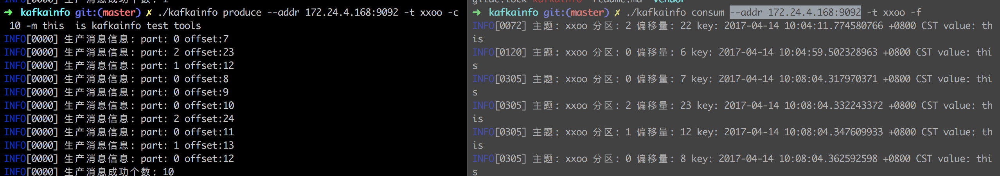
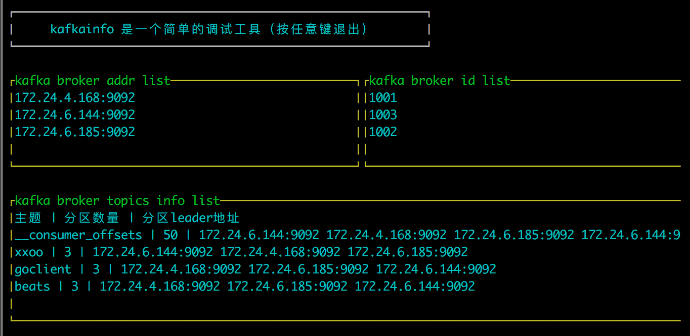

### kafkainfo 是一个用于调试kafka的命令行工具

#### 安装

> 源码build

```shell

# clone
export GOPATH=`pwd`
mkdir -p  $GOPATH/src/github.com/wupeaking && cd $GOPATH/src/github.com/wupeaking
git clone git@github.com:wupeaking/kafkainfo.git && cd kafkainfo

# build
go build -o kafkainfo main.go

```

> 直接下载二进制执行文件

```shell
# Linux 64bit
curl -o kafkainfo -L https://github.com/wupeaking/kafkainfo/releases/download/v0.0.1/kafkainfo-linux64

# mac
curl -o kafkainfo -L https://github.com/wupeaking/kafkainfo/releases/download/v0.0.1/kafkainfo-mac
```shell


#### 命令

> 查看所有子命令

```shell
➜  kafkainfo git:(master) ✗ ./kafkainfo -h
NAME:
   kafkainfo - kafkainfo是一个简单的调试kafka的命令行工具

USAGE:
   kafkainfo [global options] command [command options] [arguments...]

VERSION:
   0.0.1

COMMANDS:
     topics      kafka的topic信息
     partitions  kafka的指定topic的分区
     brokers     kafka的指定所有brokers
     produce     向kafka生成若干消息
     consum      消费kafka消息
     uishow      在shell上图形化显示kafka概述信息
     help, h     Shows a list of commands or help for one command

GLOBAL OPTIONS:
   --help, -h     show help
   --version, -v  print the version
```


> topics相关命令

```shell

# 列出所有的主题
➜  kafkainfo git:(master) ✗ ./kafkainfo topics  --addr 172.24.4.168:9092  list
INFO[0000] 所有的topics: [__consumer_offsets xxoo goclient beats]

# 某个主题的某个分区的leader信息
➜  kafkainfo git:(master) ✗ ./kafkainfo topics  --addr 172.24.4.168:9092   -t beats -p 0 leader
INFO[0000] topic:beats part:0 addr: 172.24.4.168:9092 id:1001
```


> partitions命令

```shell
# 列出某个topic的所有分区
➜  kafkainfo git:(master) ✗ ./kafkainfo partitions --addr 172.24.4.168:9092 -t beats
INFO[0000] beats的分区情况: [0 1 2]
```

> brokers命令

```shell

# 列出kafka的所有集群
➜  kafkainfo git:(master) ✗ ./kafkainfo brokers --addr 172.24.4.168:9092
INFO[0000] id: 0x131cac0 addr: 172.24.4.168:9092         index:=0
INFO[0000] id: 0x131cac0 addr: 172.24.6.144:9092         index:=1
INFO[0000] id: 0x131cac0 addr: 172.24.6.185:9092         index:=2
```

> produce与consum 命令

```shell

➜  kafkainfo git:(master) ✗ ./kafkainfo produce -h
NAME:
   kafkainfo produce - 向kafka生成若干消息

USAGE:
   kafkainfo produce [command options] [arguments...]

OPTIONS:
   --addr value, --ip value   kafka集群的任意一个地址
   -t value, --topic value    指定topic
   -m value, --message value  消息内容
   -c value, --count value    生产几份消息 (default: 0)

➜  kafkainfo git:(master) ✗ ./kafkainfo consum -h
NAME:
   kafkainfo consum - 消费kafka消息

USAGE:
   kafkainfo consum [command options] [arguments...]

OPTIONS:
   --addr value, --ip value  kafka集群的任意一个地址
   -t value, --topic value   指定topic
   -c value, --count value   消费几份消息 (default: 0)
   -f, --forerver            一直消费 直到按下Ctrl-C
```



#### ui显示

> ./kafkainfo uishow --addr 172.24.4.168:9092




